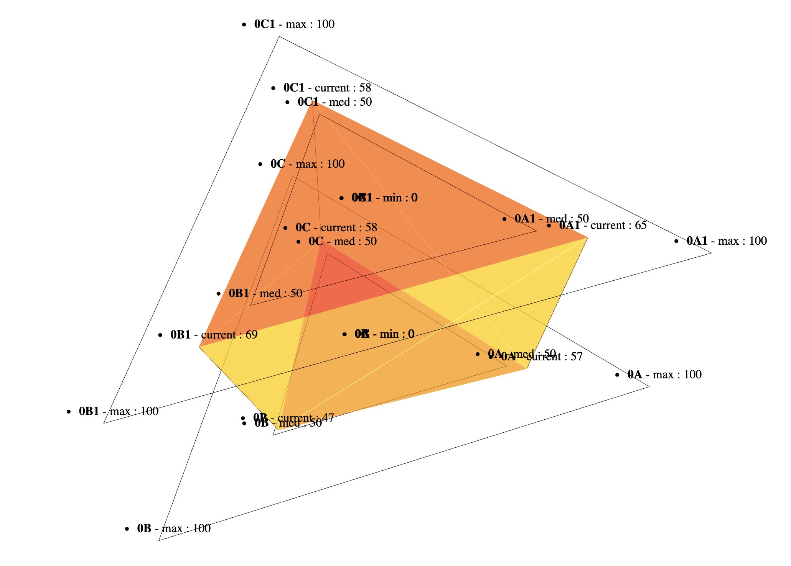

# Palindrome.js


>***A palindrome is a word, number, phrase, or other sequence of characters which reads the same backward as forward, such as madam, racecar. There are also numeric palindromes, including date/time stamps using short digits 11/11/11 11:11 and long digits 02/02/2020.***

```Palindrome.js``` is a ```three.js``` based library which provides a 3D library for system metrics and KPIs. Presented as metrics sets within layers, ```Palindrome.js``` helps to easily identify relations between metrics, indicators, behaviors or trends for your realtime systems or any other data source. Custom algorithms, visual behaviors, styles and color schemes can easily be modified or added.




***```Palindrome.js``` is still considered as an experimental / beta prototype, feedbacks are more than welcome !***

### Motivation

Idea behind this project is to go one step further current monitoring and dashboards solutions, by enabling a scalable and user oriented, 3D monitoring probe for multi-dimensional and heterogeneous sets of data points. Compatible ue cases are various, from comparing system metrics with external indicators, to stacking up multi-tenancy informations groups for measuring differences or similarities, ```Palindrome.js``` can both be used as a live UI component for a larger BI dashboard, or as the signal source for a computer-vision based workflow.

## Tech/framework used
Project is created with:

* Three.js
* love <3

## Setup
This project uses ```yarn``` as the dependency manager, ```parcel-bundler``` as the packager, ```three.js``` as its 3D renderer and ```storybook``` for functional testing. 

First install the project dependencies :

```
yarn install
```

### Storybook
Then, run ```storybook``` for an interactive session :

```
yarn storybook
```

*If for some reason the ```knobs``` panel isn't showing up, open your  browser developer console and type ```localStorage.clear()```*


### Default HTML
Alternatively, you can run the default html session :

```
yarn dev
```


### API Reference

Todo : add API or configuration documentation

### How to add your usecase ?

Todo : add a step by step integration documentation

### Connect with remote data source

Todo : add integration details

### Contribute

Simply open a pull request over the repository to describe your changes.

### Credits
- Rnd Team @ Alter Way
- Farooque Mustafa
- Damien Gilles
- Jonathan Rivalan

### License
Licensed under the Apache 2.0 license
