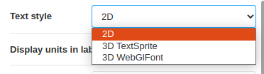
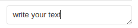
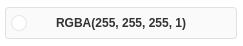
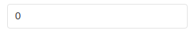

# Palindrome.js


>***A palindrome is a word, number, phrase, or other sequence of characters which reads the same backward as forward, such as madam, racecar. There are also numeric palindromes, including date/time stamps using short digits 11/11/11 11:11 and long digits 02/02/2020.***

```Palindrome.js``` is a ```three.js``` based library which provides 3D visualization for system metrics and KPIs. Presented as metrics sets within layers, ```Palindrome.js``` helps to easily identify relations between metrics, indicators, behaviors or trends for your realtime systems or any other data source. Custom algorithms, visual behaviors, styles and color schemes can easily be modified or added.

<p float="left">


</p>

_**```Palindrome.js``` is still considered as an experimental / beta prototype, feedbacks are more than welcome !**_

## Motivation

Idea behind this project is to go one step further current monitoring and dashboards solutions, by enabling a scalable and user oriented, 3D monitoring probe for multi-dimensional and heterogeneous sets of data points. Compatible use cases are various, from comparing system metrics with external indicators, to stacking up multi-tenancy informations groups for measuring differences or similarities, ```Palindrome.js``` can both be used as a live UI component for a larger BI dashboard, or as the signal source for a computer-vision based workflow.

## Tech/framework used
Project is created with:

* Three.js
* love <3

## Setup
This project uses ```yarn``` as the dependency manager, ```parcel-bundler``` as the packager, ```three.js``` as its 3D renderer and ```storybook``` for functional testing.

First install the project dependencies :

```
yarn install
```

## Storybook
Then, run ```storybook``` for an interactive session :

```
yarn storybook
```

*If for some reason the ```knobs``` panel isn't showing up, open your  browser developer console and type ```localStorage.clear()```*


## Default HTML
Alternatively, you can run the default html session :

```
yarn dev
```


## API Reference
Configuration parameter and its options

|  Name| Description |option |
| ------ | ------ | ------ |
| Text style | To change the style of the labels | Multi select : 2D(Default option), 3D TextSprite, 3D WebGlFont |
| Display units in labels | To display or not the units of labels | Check button |
|Text size | To change the size of the labels| Small, Medium (Default option), Large |
|Text color | To change the color of the labels | Color input|
|Bold text | To put the labels in bold or not | Check button |
|Italic text | To put the labels in italic or not | Check button |
|Character font | To change the characters of the labels| Multi select : Arial (Default option), Serif, Sans-serif |
|Mockup data | To make dynamic the data | Check button |
|Palindrome size | To resize the palindrome | Number input |
|Display sides | To display or not the sides of palindrome | Check button |
|Display sides mode | To configure the sides mode| Text input |
|Display layers | To display or not the layers of palindrome| Check button |
|Display layers mode | To configure the layers mode| Text input |
|Display labels | To display or not the labels | Check button |
|Display all labels | To display or not all the labels| Check button |
|Display grid | To display or not the grid of the plan| Check button |
|Grid size | To resize the grid | Number input |
|Grid divisions | To define the divisions of the grid | Number input |
|Metric Magnifier | To resize the metrics | Number input |
|Layer status control | To resize the metrics | Check button |
|Layer mid color | To change the layer mid color | Color input |
|Main app color | To change the main app color | Color input |
|Sub app color | To change the sub app color | Color input |
|Status range low | To resize the low status range | Number input |
|Status range med | To resize the med status range | Number input |
|Status range high | To resize the high status range | Number input |
|Status color low | To change the low status color | Color input |
|Status color med | To change the med status color | Color input |
|Status color high | To change the high status color | Color input |
|Line color | To change the line color | Color input |
|Line opacity | To change the line opacity | Number input |
|Line transparency | To change the line transparency | Number input |
|Line width | To resize the line widht | Number input |
|Zplane initial | To resize the initial zplane | Number input |
|Zplane height | To resize the height zplane | Number input |
|Zplane multilayer | To resize the multilayer zplane |Number input |

### Table legend
|  Option | Display  |
| ------ | ------  |
| Multi select |  |
| Text input |  |
| Color input |  |
| Number input |  |
| Check button |  |

## How to add your usecase ?

Todo : add a step by step integration documentation

## Connect with remote data source

Todo : add integration details
(Default option)
## Contribute

Simply open a pull request over the repository to describe your changes.

## Credits
- Rnd Team @ Alter Way
- Farooque Mustafa @farooquemustafa
- Damien Gilles @gillesdami
- Jonathan Rivalan (author) @JonRiv

## License
Licensed under the Apache 2.0 license