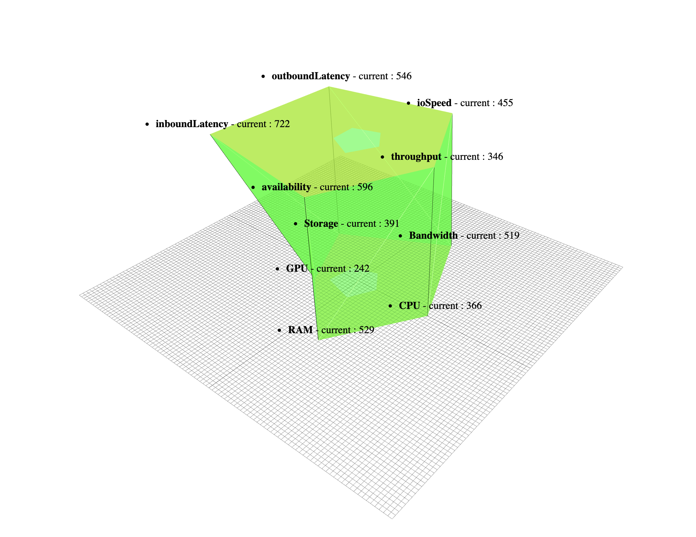
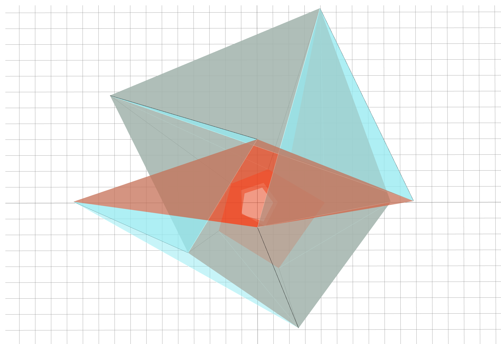
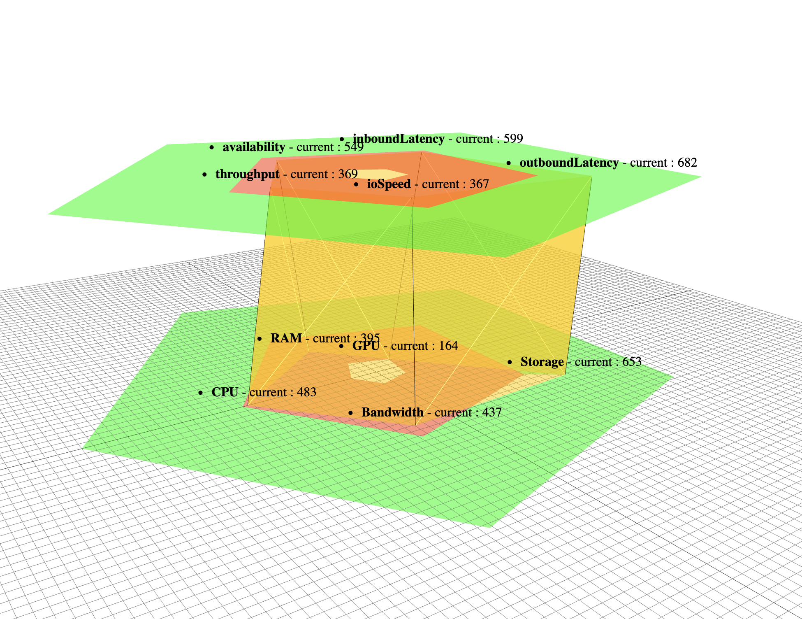
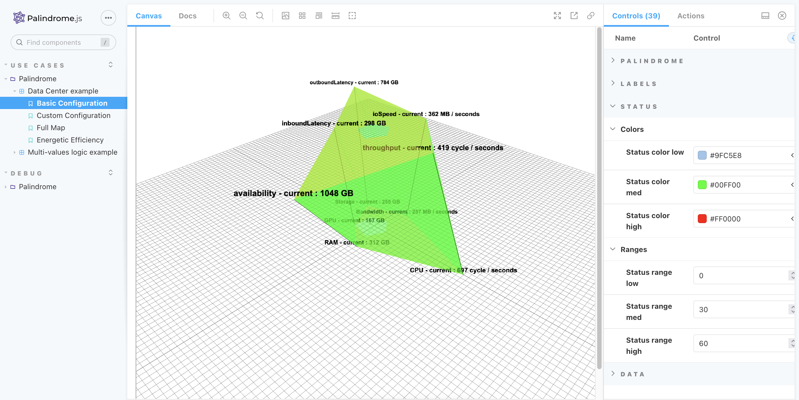
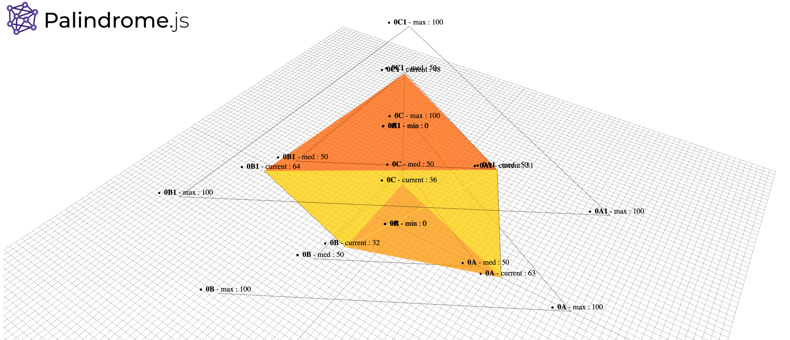

# Palindrome.js


>***A palindrome is a word, number, phrase, or other sequence of characters which reads the same backward as forward, such as madam, racecar. There are also numeric palindromes, including date/time stamps using short digits 11/11/11 11:11 and long digits 02/02/2020.***

```Palindrome.js``` is a ```three.js``` based library which provides 3D visualization for system metrics and KPIs. Presented as metrics sets within layers, ```Palindrome.js``` helps to easily identify relations between metrics, indicators, behaviors or trends for your realtime systems or any other data source. Custom algorithms, visual behaviors, styles and color schemes can easily be modified or added.

<p float="left">



</p>

_**```Palindrome.js``` is still considered as an experimental / beta prototype, feedbacks are more than welcome !**_

## Motivation

Idea behind this project is to go one step further current monitoring and dashboards solutions, by enabling a scalable and user oriented, 3D monitoring probe for multi-dimensional and heterogeneous sets of data points. Compatible use cases are various, from comparing system metrics with external indicators, to stacking up multi-tenancy informations groups for measuring differences or similarities, ```Palindrome.js``` can both be used as a live UI component for a larger BI dashboard, or as the signal source for a computer-vision based workflow.

## Tech/framework used
Project is created with:

* Three.js
* love <3

## Setup
This project uses ```yarn``` as the dependency manager, ```parcel-bundler``` as the packager, ```three.js``` as its 3D renderer and ```storybook``` for functional testing.

First install the project dependencies :

```
yarn install
```

## Storybook
Then, run ```storybook``` for an interactive session :

```
yarn storybook
```

*If for some reason the ```knobs``` panel isn't showing up, open your  browser developer console and type ```localStorage.clear()```*




## Default HTML
Alternatively, you can run the default html session :

```
yarn dev
```



## API Reference
Configuration parameters and their options

| Name| Description | type | Default | Options |
| ------ | ------ | ------ |------ |------ |
| Label style | Change the style of the labels | String | 3D TextSprite | '2D', '3D TextSprite', '3D TextWebGlFont'  |
|Label character font | Change the characters of the labels | String| Serif | 'Arial', 'Serif', 'Sans-serif' |
|Label size | Change the size of the labels| String| Medium |'Small', 'Medium', 'Large' |
|Label color | Change the color of the labels | String| #000000 | - |
|Bold label | Put the labels in bold or not | Boolean| True | -|
|Italic label | Put the labels in italic or not | Boolean| False | -|
| Display units in labels | Display or not the units of labels | Boolean| True | -|
|Display labels | Display or not the labels | Boolean| True | -|
|Display all labels | Display or not all the labels| Boolean| False | -|
|Metric Magnifier | Resize the metrics | Number | 10 | -  |
|Palindrome size | Resize the palindrome | Number | 3 | -  |
|Display layers mode | Configure the layers mode| String | dynamic | -|
|Layer mid color | Change the layer mid color | String | #DFDF0B | - |
|Display layers | Display or not the layers of palindrome| Boolean| True | -|
|Layer status control | Resize the metrics | Boolean| True | -|
|Line opacity | Change the line opacity | Number | 1 | -  |
|Line width | Resize the line widht | Number | 0,5 | -  |
|Line color | Change the line color | String | #000000 | - |
|Display sides mode | Configure the sides mode| String | dynamic | -|
|Main app color | Change the main app color | String | #00FF06 | - |
|Sub app color | Change the sub app color | String |#9FC5E8 | - |
|Display sides | Display or not the sides of palindrome | Boolean| True | -|
|Grid size | Resize the grid | Number | 100 | -  |
|Grid divisions | Define the divisions of the grid | Number | 100 | -  |
|Display grid | Display or not the grid of the plan| Boolean| True | -|
|Zplane initial | Resize the initial zplane | Number | 0 | -  |
|Zplane height | Resize the height zplane | Number | 40 | -  |
|Zplane multilayer | Resize the multilayer zplane |Number | -20 | -  |
|Status color low | Change the low status color | String |#9FC5E8 | - |
|Status color med | Change the med status color | String |#00FF00 | - |
|Status color high | Change the high status color | String |#FF0000 | - |
|Status range low | Resize the low status range | Number | 0 | -  |
|Status range med | Resize the med status range | Number | 30 | -  |
|Status range high | Resize the high status range | Number | 60 | -  |
|Data | The data we analyze | Json | Default json data | -|
|Mockup data | Make dynamic the data | Boolean|True | -|

## How to add your usecase ?

Todo : add a step by step integration documentation

## Connect with remote data source

Todo : add integration details
(Default option)
## Contribute

Simply open a pull request over the repository to describe your changes.

## Credits
- Rnd Team @ Alter Way
- Koku ulrich GBLOKPO @koku-ulrich.gblokpo
- Farooque Mustafa @farooquemustafa
- Damien Gilles @gillesdami
- Jonathan Rivalan (author) @JonRiv


## License
Licensed under the Apache 2.0 license