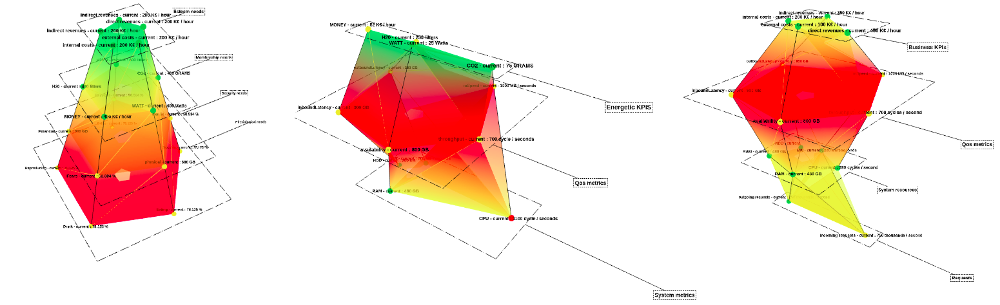
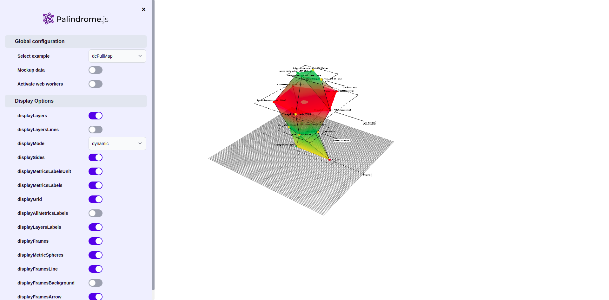
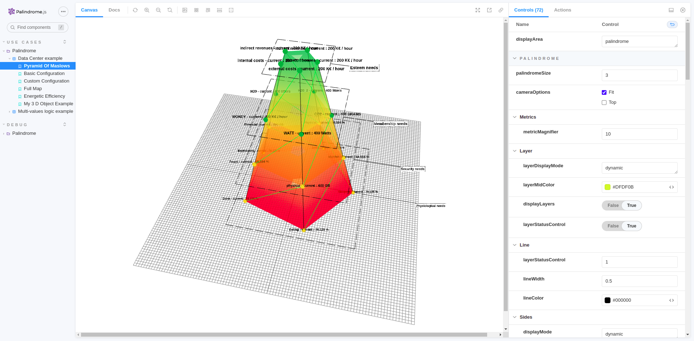

# Palindrome.js


> ***A palindrome is a word, number, phrase, or other sequence of characters which reads the same backward as forward,
such as madam, racecar. There are also numeric palindromes, including date/time stamps using short digits 11/11/11 11:11
and long digits 02/02/2020.***

```Palindrome.js``` is a ```three.js``` based library which provides 3D monitoring for system metrics and KPIs.
Presented as metrics sets within layers, ```Palindrome.js``` helps to easily identify relations between metrics,
indicators, behaviors or trends for your realtime systems or any other data source. Custom algorithms, visual behaviors,
styles and color schemes can easily be modified or added.

_**```Palindrome.js``` is still considered as an experimental / beta prototype, be aware API can change at any moment.
Feedbacks are more than welcome !**_

<p float="left">

</p>

## Motivation

Idea behind this project is to go one step further current monitoring and dashboards solutions, by enabling a scalable
and user oriented, 3D monitoring probe for multi-dimensional and heterogeneous sets of data points. Compatible use cases
are various, from comparing system metrics with external indicators, to stacking up multi-tenancy informations groups
for measuring differences or similarities, ```Palindrome.js``` can both be used as a live UI component for a larger BI
dashboard, or as the signal source for a computer-vision based workflow.

## Tech/framework used

Project is created with:

* Three.js
* love <3

## Setup

This project uses ```three.js``` as its 3D renderer, ```yarn``` as the dependency manager, ```storybook``` for
functional testing and ```parcel-bundler``` as the stand-alone packager.

First install the project dependencies :

```
yarn install
```

## Default HTML

Then, run the default html session for an interactive session :

```
yarn dev
```



## Storybook

Alternatively, you can run storybook :

```
yarn storybook
```



## Docker

You can as well, run Palindrome.js on docker :

```
docker-compose up
```

## Documentation

Click [here](https://git.rnd.alterway.fr/overboard/palindrome.js/-/wikis/home) to visit our wiki page containing the
documentation with all the implementation details.

## Contribute

Simply open a pull request over the repository to describe your changes.

## Credits

- Rnd Team @ Alter Way
- Koku Ulrich GBLOKPO @koku-ulrich.gblokpo
- Mohamed Ali YACOUBI @yacoubii
- Farooque Mustafa @farooquemustafa
- Damien Gilles @gillesdami
- Jonathan Rivalan (author) @JonRiv

## License

Licensed under the Apache 2.0 license
